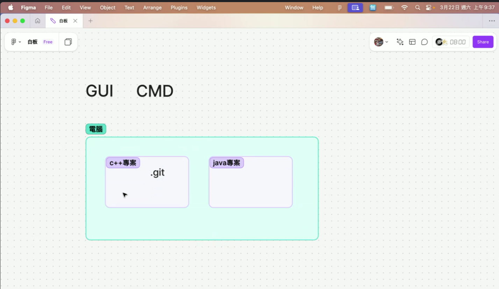
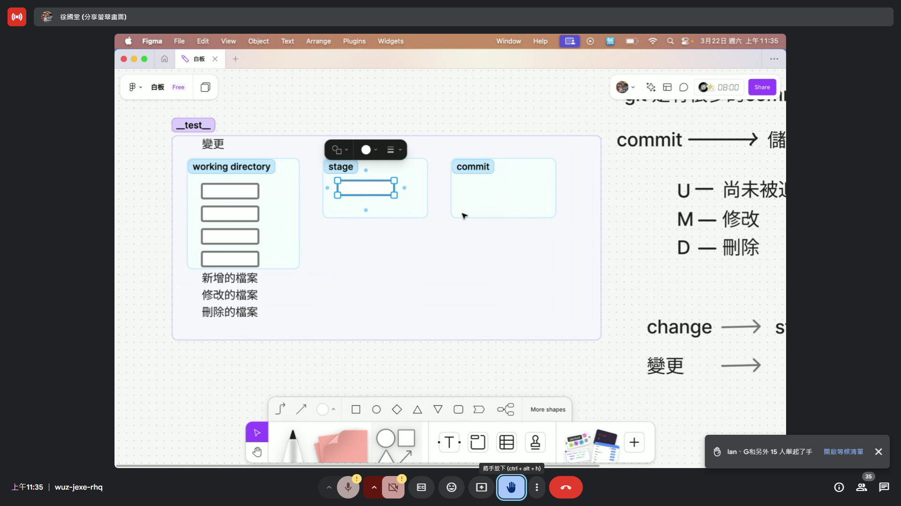
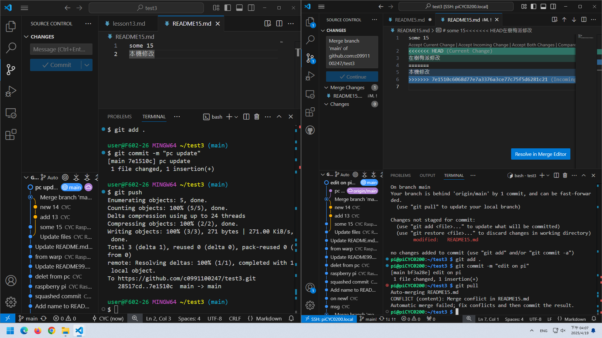

# 2025.03.15 session
## online meeting room
- [meeting room](https://meet.google.com/wuz-jexe-rhq)
## prelim
- the course will cover GitHub first, then Git
- subfolder can be created in file field following by a slash line, so GitHub will recognize it as a subfoler rather than a file
```markdown
## hyperlink
- [link](./subfolder)
```
## markdown basic
- create a README.md inside a GitHub repository, and it will appear in the bottom section of folder (or subfolder)
- repository purpose: project-based folder
- *.md* stands for markdown
- on GitHub, markdown syntax might differ from markdown(s) in other interface   
[instruction](https://docs.github.com/en/get-started/writing-on-github/getting-started-with-writing-and-formatting-on-github/basic-writing-and-formatting-syntax)
- linebreak: back slash or double space in the end of sentence
- other commands refer to [link](./subfolder/README.md)
- crossout by tilda
```markdown
~~deleted~~
```
- subcript denoted by ac<sub>c</sub>
- a tag can be expressed by parentheses `tag`
- underline a text can be expressed with
```
something to <ins>underscore</ins>
```
## header structure
- denoted by pound key
- up to sixth header is possible in markdown syntax
## insert picture

## track change in Github: show diff
- commit: note the change in this version (by clicking "show diff") as this functions in a similar way to MS Word track edit
- inside commit a message can be attached to memo update/revision in this file
## An online IDE: GitHub Codespaces 
- from *Codespaces*, user can launch vscode with access to virtual machine that executes the script
- make sure to terminate a session to prevent credit/token exhaustion 

# 2025.03.22 session

## Git setup
- Git is default installed in Mac and Linux, but not in Windows
- download via [download link](https://git-scm.com/downloads/win)
## Git bash 
```
cd "(path)"
git init
rm -r .git
```
- this function can be executed via VSCode interface, or terminal within VSCode
- once a `.git` was created in a folder, all of its subfolders are linked
- namely, do not create `.git` for subfoler
## VSCode
- `U` untracked
- `M` modified
- `D` deleted
### procedure
1. change 變更
2. staged change 儲存變更
3. commit 提交 (with a commit message)

> for commit message, `vim` syntax is used. `i` for insert, `ESC` exits the insert mode
> `:w` indicates writ, while `:q` exits
# 2025.03.29 session

## principle of Git
- git for each folder (i.e., repository)
- do not use git for root directory
- local git can by **synchronized** with a repository on GitHub (other cloud provider exists)

## set up git on local PC
1. [download link](https://git-scm.com/downloads)
2. initiate batch console
3. set up name and email on local PC ([instruction](https://stackoverflow.com/a/42167480))
4. alternatively, beginner user can rely on Warp AI terminal for code support
5. if set up glocal user name and email via the command ``git config --global``, the user name and email will be default for all subfolder
6. it is also possible to create different user profiles for each subfolders

## set up repository in GitHub
1. adding a README.md for the repo can accelerate synchronization
2. use ``.gitignore`` command to filter which file *not* to track
3. select a license for other users to utiliza this repo
4. following steps above, the repo will be created with ``README.md``, ``.gitignore`` and ``LICENSE``
5. once created, click CODE (green bottom, HTTPS tab) and retrieve git path ending with ``.git`` for clone into local PC

## synchronize from GitHub to local PC
1. (with batch) change directory to subfolder in local PC
2. ``git clone <GitHub path ending with .git>`` and wait for the synchronization
3. (optional) following the path, add a space and create new folder name
4. (alternative 1) use GitHub for desktop for graphical interface (login and password required)
5. (alternative 2) use VSCode to clone from GitHub (login and password required). This option is preferred by instructor. Beware to switch folder when working on a non-track folder. Also, close the folder when tracking is no longer required.

## synchronize a local folder onto GitHub
1. create a folder via VSCode or finder, create a README.md, and  init git for this folder
2. be familiar with stage (``add``) and unstage (``reset``)
3. publish branch from local to GitHub (incl version history)
4. **issue**: branch name main vs. master
> The issue between main and master usually occurs because the default branch name for new repositories on GitHub changed from master to main in mid-2020. As a result, some repositories still use master as the default branch, while newer ones use main. (ChatGPT)
5. *fastforward* means the change is an extension to existing main line, while the file history match that of the main line

## relationship between commits
- each commit records the change history of a set of files
- the label ``main`` indicate the history of change is updated to this version

# 2025.04.12 session
## setup 
- get a wifi receiver from TA
- connect Raspberry Pi to power (wifi and SSH have been setup previously)
- on PC download git and initiate
- on PC download VS code, along with application `Remote-SSH` inside VS code
- connect PC and Raspberry Pi (refer to LLM for instruction help) so user can control Raspberry Pi from PC keyboard and mouse
- connect both device to GitHub
## concept for the course
- Raspberry Pi as second device; PC as first device
- use GitHub as intermediary to synchronize collaboration between the 2 devices
- a rule of thumb: always `pull` the latest edition before making change in a new device
## FAQ
- if `pull` version reports conflict, user may choose between `merge`, `rebase`, or `fast-forward` (available only via command line)
- in command line, use `git fetch origin main` to check status from online repo
- when there's a new version obtained via `git pull`, it will be committed automatically. A prompt will appear asking user to add note (in `vim` language)
- `git log --oneline` provide information whether current `HEAD` is `main`
## concept of conflicted version
- we replicate this conflict by editing the same filename on two devices (PC and Raspberry Pi) without pull, and commit the change to GitHub
- then, when we pull from another device, an error message will appear prompting that change shall be commited before pull
- best practice (?): always make change to the latest edition
- `git push --force` this function will overwrite the edition on GitHub online. This shall not be executed when collaborating with other using the same repo
## definition
- `HEAD` means current location
- `git merge` combines from branch and may trigger `fast-forward`
- `claude` via `copilot` is available to draft and compile command in vscode
## misc
- aggregate commit provide a concise way to record update in git
> squashing commits, and Git offers a few ways to do this. It’s super useful when you want to clean up your commit history before merging a branch — especially if you’ve made lots of small or messy commits.
- there exist many AI tools in VSCode that support coding, such as `CLINE` which links to many LLM models and is able to executed files in VSCode environment
# 2025.04.19 session
## Warp AI terminal
- use `Ctrl + I` for LLM support
- enter git repo stored in Raspberry Pi via Warp
- `nano` is an editor on Raspberry Pi
- in brief, we can manipulate raspberry pi from Warp as well as VSCode
## connection between GitHub and local git
- create token from GitHub is one way of authentication. This is useful with GitHub CLI (commandline login, possible via Raspberry Pi but not lab PC due to campus security setting)
- `SSH` connection funcions are useful while set repo-specific connection
## troubleshooting
- simulate conflict when a push is rejected due to update from another user on the branch
- simulate conflict when two users edit the same file

# 2025.04.26 session
## vscode extension
- gemini code assistant
- copilot (best performance)
- CLINE
## CLINE
- plan mode: conversation
- act mode: have CLINE to modify files on my behalf
- in plan mode, choose google gemini and insert API key
- other API is available, such as OpenRouter
- vibe coding (programming using natural language, in contrast to LLM)
```
Git is a cornerstone of research reproducibility, especially in fields like economics research, where transparency and the ability to replicate results are paramount. By making programming scripts available through platforms like GitHub, researchers ensure that their work can be easily cloned, verified, and built upon, fostering a culture of integrity and collaborative research. Mastering Git and GitHub is crucial for any academic researcher, as it empowers them to share their code efficiently, track revisions, and collaborate seamlessly across teams.

I recently completed an intensive training at Chilee University of Technology in New Taipei City, spanning six weekends from March to April. This training focused on enhancing my skills in Git, GitHub, and remote programming tools, providing me with essential knowledge for version control, collaborative development, and cross-device synchronization in research projects. The course also introduced me to Raspberry Pi configuration via SSH, and I used WARP, an LLM-based terminal, for remote management. I also leveraged VSCode’s Remote-SSH extension to facilitate cross-device collaboration and streamline development workflows.

Throughout the training, I enhanced my coding practices with AI tools like CLINE and GitHub Copilot, integrating LLM support to automate tasks and solve problems more efficiently. I would like to express my gratitude to our teaching assistant, [TA’s LinkedIn Profile], for their invaluable support during this course. Additionally, I am deeply thankful to the Ministry of Labor for their generous funding, which made this opportunity possible. This training has significantly improved my capacity for collaborative academic work, and I look forward to applying these skills to future research projects.

#Git #GitHub #ResearchReproducibility #EconomicsResearch #AI #LLM #StatisticalProgramming #RaspberryPi #RemoteDevelopment #TechTraining #AcademicCollaboration #MinistryOfLabor
```
